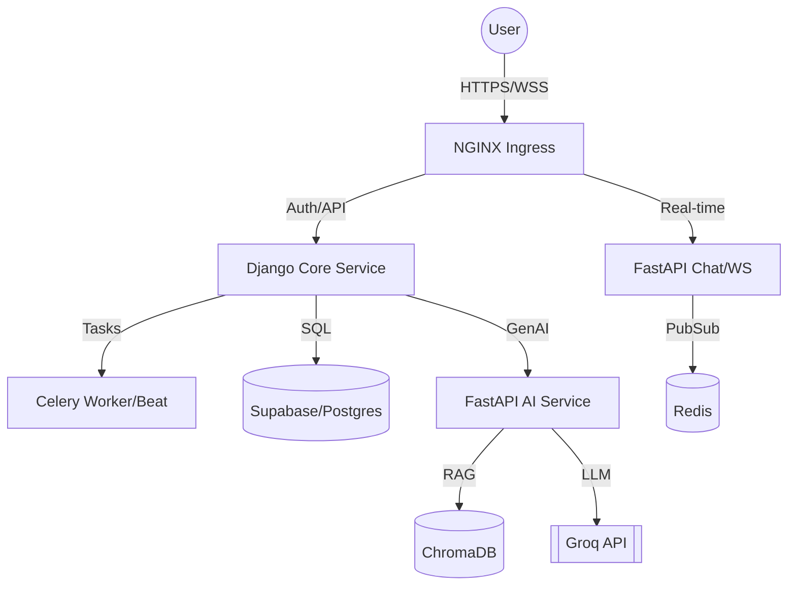

# ⚔️ Clash of Code - Backend Services

A high-performance, distributed microservices architecture powering the **Clash of Code** platform. Built with a focus on real-time engagement, AI-driven code analysis, and robust competitive scalability.

---

## 🏛️ System Architecture

The platform is designed as a modular ecosystem of specialized services communicating via secure internal APIs and real-time event streams.



| Service | Technology | Role |
| :--- | :--- | :--- |
| **[Core](./core)** | Django / DRF | Central API, JWT Auth (OAuth/OTP), Business Logic, Payments (Razorpay), Task Queue (Celery). |
| **[Chat](./chat)** | FastAPI / WebSockets | Real-time messaging, Global Notifications, Presence tracking. |
| **[AI](./ai)** | FastAPI / LangChain | AI Challenge Generation, Code analysis, RAG pipeline. |
| **[Vector-DB](./vector-db)** | ChromaDB | High-dimensional embedding storage for AI context. |

---

## 🛠️ Technology Stack

- **Core Frameworks**: Django 5.0, FastAPI
- **Database**: PostgreSQL (Supabase) & ChromaDB (Vector)
- **Real-time**: Redis & WebSockets
- **Task Queue**: Celery with Redis Broker
- **Cloud/Infra**: AWS (SES, S3), K3s (Kubernetes), Cloudinary (Media)
- **AI**: Groq (Llama 3.3/70B), Sentence-Transformers

---

## 🚀 Quick Start (Development)

Ensure you have [Docker](https://www.docker.com/) installed and configured.

1. **Clone the repository**

   ```bash
   git clone https://github.com/jithin-jz/Clash-of-Code-services.git
   cd Clash-of-Code-services
   ```

2. **Configure Environment**
   Copy `.env.example` in each service to `.env` and fill in your keys.

3. **Spin up the stack**

   ```bash
   docker-compose up --build
   ```

---

## 🛳️ Deployment

The services are deployed on a **K3s (Kubernetes)** cluster. Manifests and deployment scripts can be found in the `/deploy` directory.

### Production Environment

- **API**: `https://api-coc.jithin.site`
- **Frontend**: `https://clashcode.jithin.site`
- **Ingress**: Managed via NGINX with Let's Encrypt SSL.

---

## 🛡️ Security & Auth

- **Asymmetric JWT**: RS256 signing for stateless, cross-service authentication.
- **CSRF Protection**: Domain-restricted cookies with `SameSite=None` and `Secure` attributes.
- **Intra-Service API Keys**: Services verify shared secrets for private internal requests.
- **OAuth 2.0**: Native integration with Google and GitHub.

---

## 📂 Repository Structure

```text
├── core/           # Django project: Main logic, Auth, DB
├── chat/           # FastAPI: Real-time WebSockets
├── ai/             # FastAPI: AI-driven features & Vector RAG
├── deploy/         # K8s manifests (ConfigMaps, Secrets, Deployments)
└── docker-compose.yml
```

---

## 📄 License

This project is proprietary. All rights reserved.
